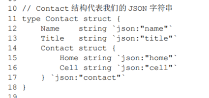

protobuf3语法指南: https://colobu.com/2017/03/16/Protobuf3-language-guide/

有看到这种格式的代码



似乎是一个struct跟一种json定义在了一起. 满足这种json格式的json串就可以通过json的方法转化为对应的struct变量


用protobuf写rpc服务的方法是: 先写proto文件, 然后用protoc生成对应语言的代码

对于go语言, 需要安装go语言对应的插件

在这个pkg下进行的测试没有成功, 他一直提示错误

```go
# google.golang.org/grpc/internal/status
E:\go\src\google.golang.org\grpc\internal\status\status.go:116:21: cannot use any (type *any.Any) as type *anypb.Any in append
E:\go\src\google.golang.org\grpc\internal\status\status.go:130:32: cannot use any (type *anypb.Any) as type *any.Any in argument to ptypes.UnmarshalAny
```

似乎是这个grpc包的内部出现了错误, 不是我的问题. 但是我觉得很奇怪, 因为不应该. 


---

2020-12-2

使用go mod进行包管理, 没有了上面那个错误了.
